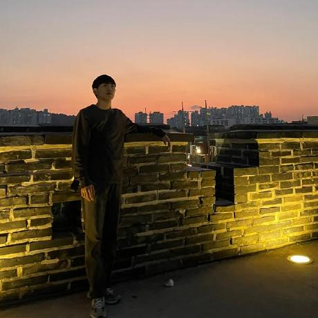
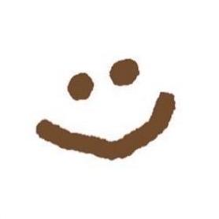
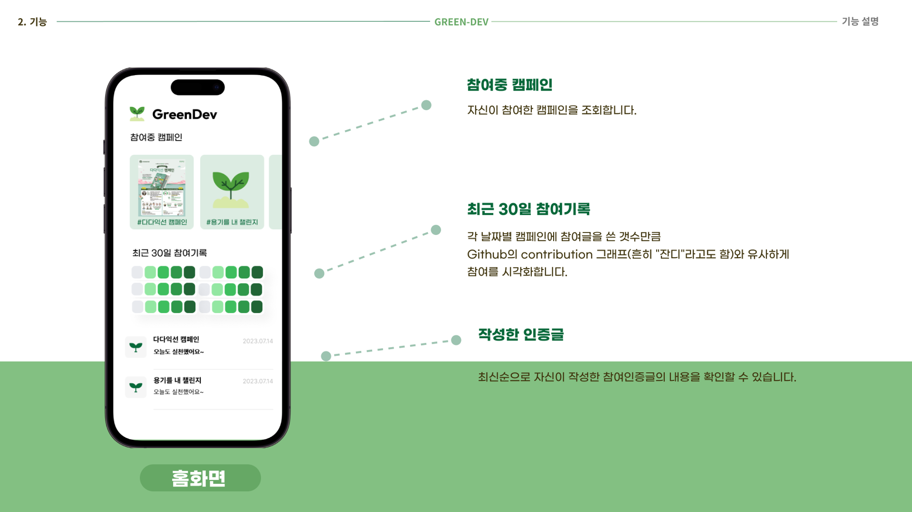
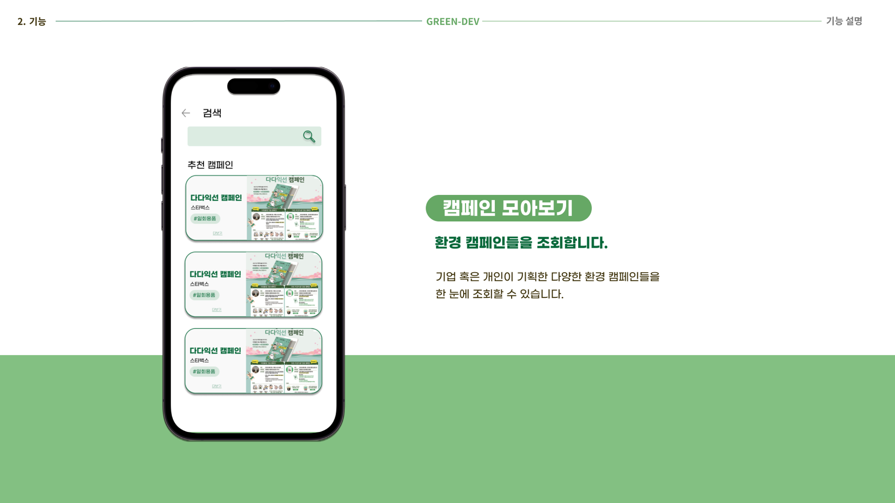
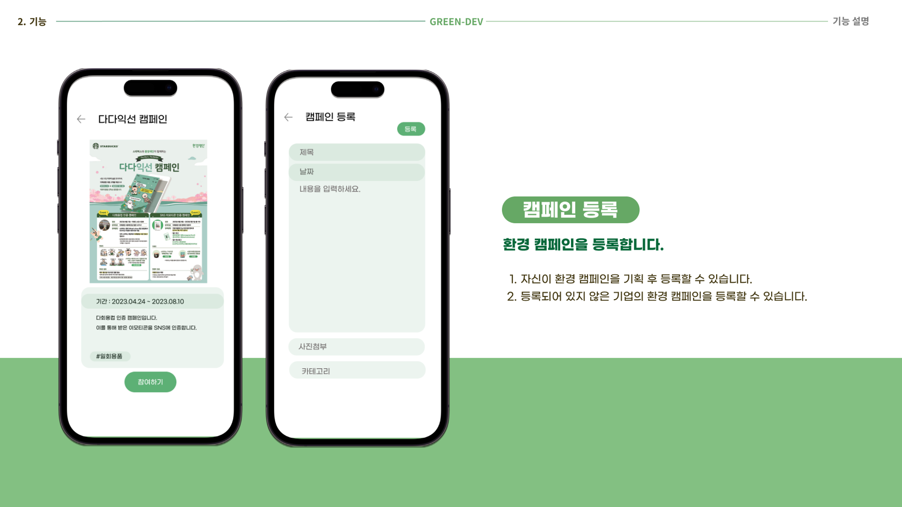
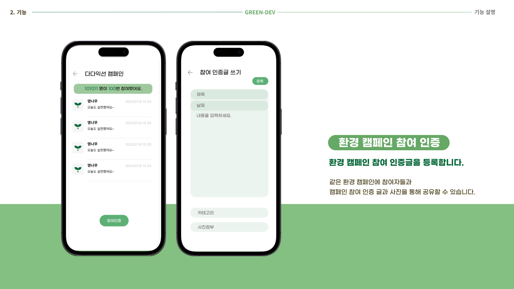
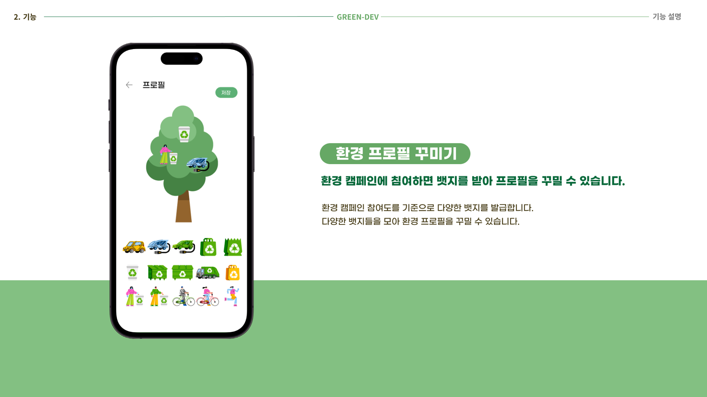
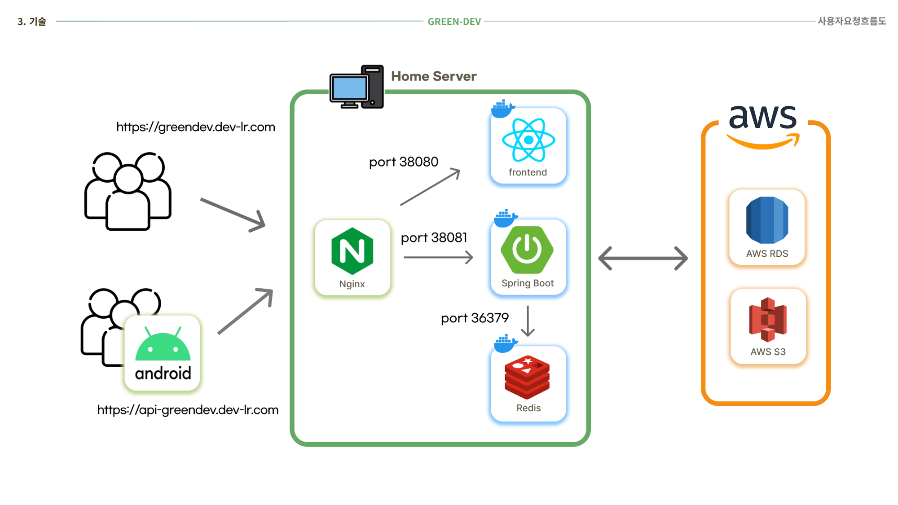
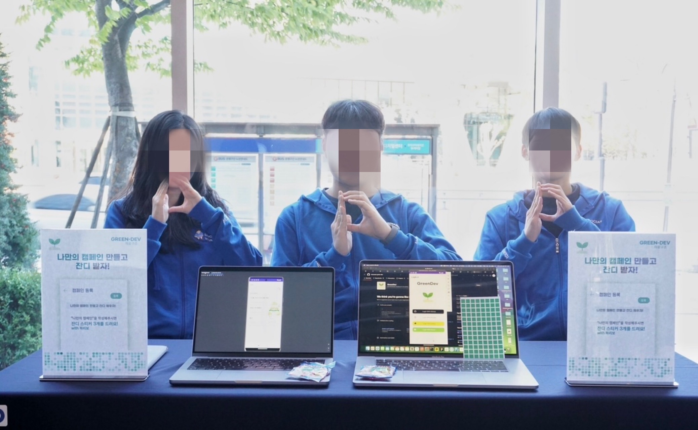

## DEVOCEAN YOUNG 2기 7조 [자료구조] GreenDev 프로젝트

| [유용민](https://github.com/yymin1022) | [강승구](https://github.com/kang9366) | [권지윤](https://github.com/june0216) | [장현정](https://github.com/JangGusWjd) |
| --- | --- | --- | --- |
|  |  |  |  |
| PM / Infra | Android | Back-End | Front-End |
| 중앙대학교 | 서울과학기술대학교 | 이화여자대학교 | 단국대학교 |

## 🌱 GreenDev?
🌱 환경 캠페인 참여 유도 웹/앱 서비스

저희 프로젝트의 타이틀인 __GreenDev__ 의 의미는,

저희와 같은 __개발자들에게__ 환경 캠페인 참여가 하나의 작지만 중요한 문화가 될 것을 목표로 하고자 하는 포부를 담아 만든 단어로,

__푸른 환경__ 을 뜻하는 __Green__ 과 __개발자__ 를 뜻하는 __Developer__ 의 합성어입니다.

## 🌱 프로젝트 기능 소개

    <h4>홈 화면</h4>
    </img>
    <h4>캠페인 모아보기</h4>
    </img>
    <h4>캠페인 등록</h4>
    </img>
    <h4>캠페인 참여 인증</h4>
    </img>
    <h4>개인별 환경 프로필</h4>
    </img>

## 🌱 프로젝트 흐름

    </img> 

## 🏆 수상
DEVOCEAN YOUNG 2기 팀 프로젝트 - "혹시 프로세요"상 

    </img> 

## 💻 데모진행

    </img> 

## 🔎 관련 URL
📄 [DEVOCEAN 블로그 프로젝트 소개](https://devocean.sk.com/community/detail.do?ID=165456)  
🎤 [DEVOCEAN Tech Day 프로젝트 발표](https://youtu.be/pJ8RYOsAuDk)
